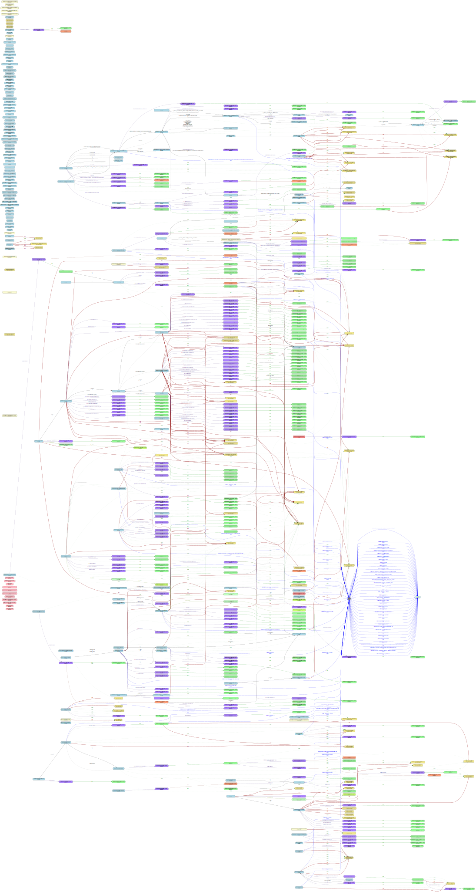
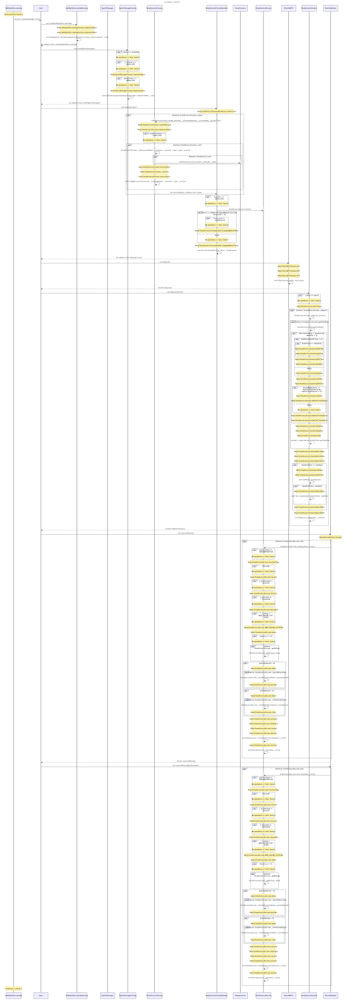

# Smart Invoice Example

Analysis of [Smart Invoice](https://github.com/SmartInvoiceXYZ/smart-invoice.git), a production DeFi escrow platform.

**Stats**: 17 contracts, 580 functions, 790 edges. Analyzed in ~500ms on Apple M3.

## Call Graph



## Sequence Diagram



## Generate It Yourself

```bash
# Clone Smart Invoice
git clone https://github.com/SmartInvoiceXYZ/smart-invoice.git
cd smart-invoice/apps/contracts/contracts

# Generate call graph
sol2cg . --format dot -o full-project.dot
dot -Tsvg full-project.dot -o full-project.svg

# Generate sequence diagram with auto-chunking
sol2cg . --format mermaid --chunk-dir ./mermaid-chunks/

# Convert Mermaid chunks to SVGs
cd mermaid-chunks
for file in chunk_*.mmd; do
    mmdc -i "$file" -o "${file%.mmd}.svg"
done
```

Output files:
- `full-project.dot` - Complete call graph (206KB)
- `mermaid-chunks/` - Chunked sequence diagrams (7 chunks)
- `*.svg` - Visualization files