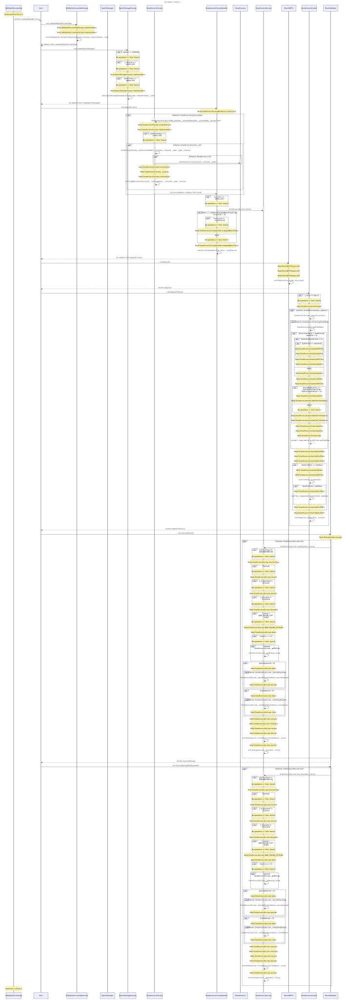

# Traverse

Static analysis tools for Solidity smart contracts. Creates call graphs, generates tests, analyzes storage patterns.

## Visualize Your Contracts

Analysis of a production DeFi escrow platform (17 contracts, 580 functions, 790 edges):

### Call Graph
[](./assets/call-graph.svg)

### Sequence Diagram
[](./assets/sequence-diagram.svg)

## Quick Start

```bash
brew tap calltrace/tap && brew install traverse
sol2cg contracts/*.sol -o graph.dot
dot -Tsvg graph.dot -o graph.svg
```

## Tools

| Tool | Purpose |
|------|---------|
| `sol2cg` | Generate call graphs (DOT/Mermaid) |
| `sol2test` | Generate Foundry test stubs |
| `sol-storage-analyzer` | Map storage reads/writes |
| `storage-trace` | Compare storage access between functions |
| `sol2bnd` | Generate interface bindings from Natspec |

## Performance

Smart Invoice benchmark (17 contracts, 580 functions, Apple M3):
- Full analysis: ~500ms
- DOT output: 206KB
- Auto-chunks large Mermaid diagrams

## Use Cases

**Security Auditors**: Map contract interactions, identify call patterns, assess storage vulnerabilities.

**Developers**: Visualize architecture, generate test suites, validate upgrades.

**Protocol Teams**: Document interactions, analyze call flows, ensure upgrade safety.

## Editor Integration

- [VS Code Extension](/integration/vscode) - Full IDE integration with UI
- [Neovim Plugin](/integration/neovim) - Zero-config Neovim 0.11+ plugin
- [Language Server](/integration/lsp) - For Emacs, Helix, Sublime, and other editors

## What's Next

- [Installation](/installation) - Setup instructions
- [Tool Documentation](/tools/sol2cg) - Detailed guides